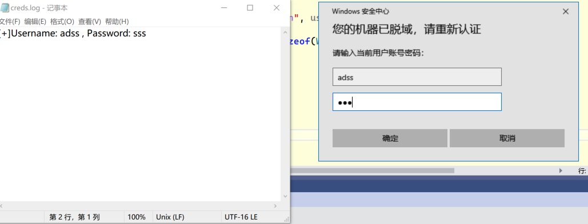

# GetWindowsCredentials

通过调用Windows API [CredUIPromptForWindowsCredentialsW](https://learn.microsoft.com/zh-cn/windows/win32/api/wincred/nf-wincred-creduipromptforwindowscredentialsw)获取用户凭证，并保存到文件。

